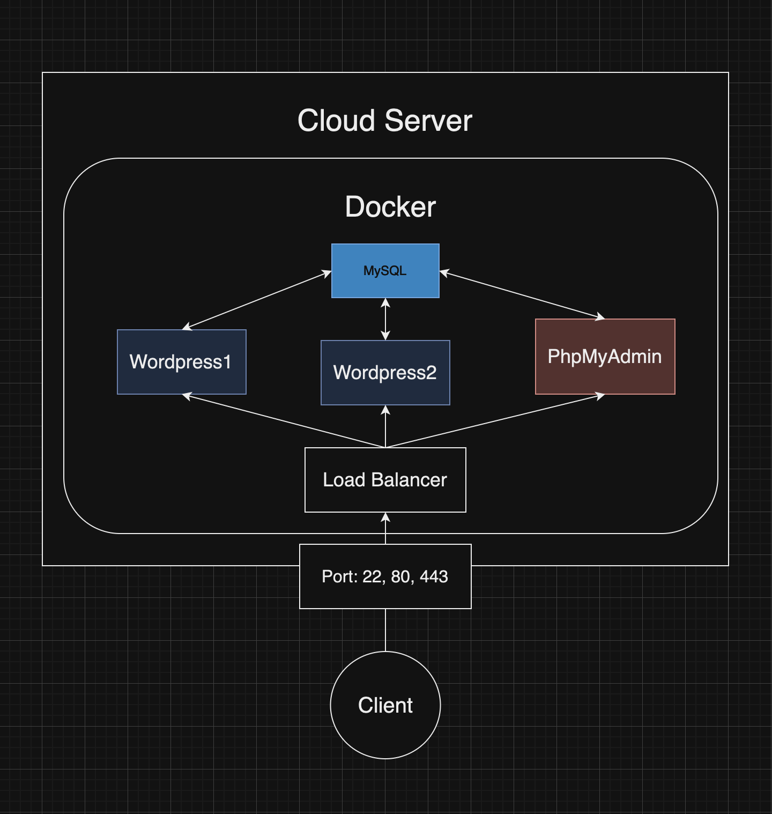

# cloud-1

## Objectif

Cloud-1 is a DevOps project at Ecole 42, where we use Ansible and Docker to deploy our WordPress website to a cloud service.



## Local development

```bash
vagrant up
ansible-playbook ./playbooks/run.yml --limit local
ansible-playbook ./playbooks/stop.yml --limit local
```

## ssh

```bash
# Create
ssh-keygen -t ed25519 -C "your comment on this key"
# Copy and send to the server you want to connect (~/.ssh/authorized_keys)
ssh-copy-id -i ~/.ssh/id_ed25519.pub [ip_address]
```

## Ansible commands

```bash
# Check local vm server connection
ansible -m ping [hostname]
ansible -m gather_facts [hostname]
ansible-playbook ./playbooks/run.yml --limit local
ansible-playbook ./playbooks/run.yml --limit remote
```

## wordpress

- id: kychoi
- pw: KyubongTest123

## Mariadb

- connection

```bash
mysql -u wp_user -pWpPassword wordpress
```

- dump (export db to use on migration)

```bash
mysqldump -u [username] -p[password] [database_name] > db_backup.sql
```

## Copy file in remote server to local

```bash
scp user@remote_host:/root/inception/backup.sql /Users/yourname/Downloads/
```

## Resources

- [Ansible Tutorial](https://youtu.be/3RiVKs8GHYQ?si=kbrnWH_QItYJZ8Gs)
